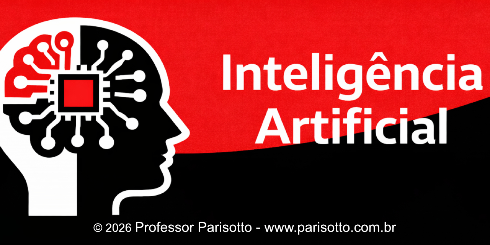
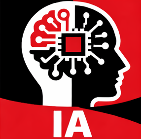

# 📘 Inteligência Artificial

Repositório com os slides das aulas apresentados em sala.

---

## 📚 Conteúdo das aulas

### 🟢 Módulo 1 — Fundamentos

- [Aula 01 — Conceito de IA e Histórico](./a01-Conceito-Historico/slides.pdf)
- [Aula 02 — Resolução de Problemas por Busca](./a02-Resolucao-Por-Busca/slides.pdf)
- [Aula 03 — Busca Informada](./a03-Busca-Informada/slides.pdf)
- [Aula 04 — Jogos](./a04-Jogos/slides.pdf)
- [Aula 05 — IA Hoje](./a05-IA-Hoje/slides.pdf)
- [Aula 06 — IA História até Hoje](./a06-IA-HistoriaAteHoje/slides.pdf)
- [Aula 07 — A IA no Cotidiano](./a07-A-IA-no-Cotidiano/slides.pdf)
- [Aula 08 — Tipos de IA](./a08-Tipos-de-IA/slides.pdf)
- [Aula 09 — Impactos Sociais e Éticos](./a09-Impactos-Sociais/slides.pdf)
- [Aula 10 — Tomada de Decisão](./a10-Tomada-de-Decisao/slides.pdf)

---

## 📌 Como usar

- Clique na aula desejada
- O slide abrirá direto no navegador
- Você também pode baixar o PDF

---

## ⚠️ Observações

- Este material é de apoio às aulas
- Os exemplos e explicações completas são apresentados em sala

---

## 👨‍🏫 Professor Parisotto

Material desenvolvido para uso em aula.
