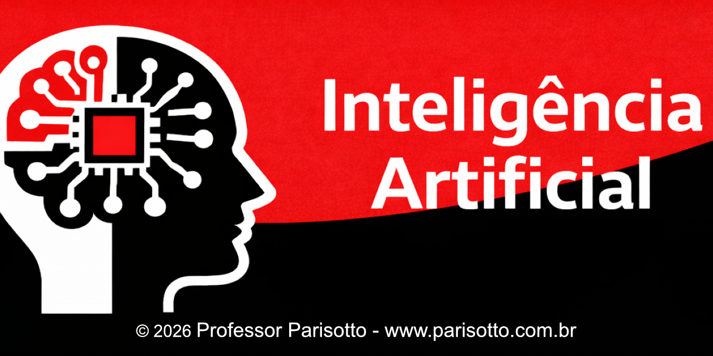
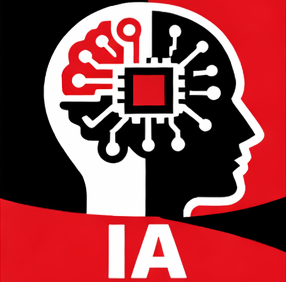

# 📘 Inteligência Artificial

Repositório com os slides das aulas apresentados em sala.

---

## 📚 Conteúdo das aulas

### 🟢 Módulo 1 — Fundamentos

- [Aula 01 — IA Hoje](slides/a01-IA-Hoje/slides.pdf)
- [Aula 02 — IA História até Hoje](slides/a02-IA-HistoriaAteHoje/slides.pdf)
- [Aula 03 — A IA no Cotidiano](slides/a03-A-IA-no-Cotidiano/slides.pdf)
- [Aula 04 — Tipos de IA](slides/a04-Tipos-de-IA/slides.pdf)
- [Aula 05 — Impactos Sociais e Éticos](slides/a05-Impac5os-Sociais/slides.pdf)
- [Aula 06 — Tomada de Decisão](slides/a06-Tomada-de-Decisao/slides.pdf)
- [Aula 07 — IAGen](slides/a07-IAGen/slides.pdf)
- [Aula 08 — Aprendizado-IAGen](slides/a08-Aprendizado-IAGen/slides.pdf)

---

## 📌 Como usar

- Clique na aula desejada
- O slide abrirá direto no navegador
- Você também pode baixar o PDF

---

## ⚠️ Observações

- Este material é de apoio às aulas
- Os exemplos e explicações completas são apresentados em sala

---

## 👨‍🏫 Professor Parisotto

Material desenvolvido para uso em aula.
